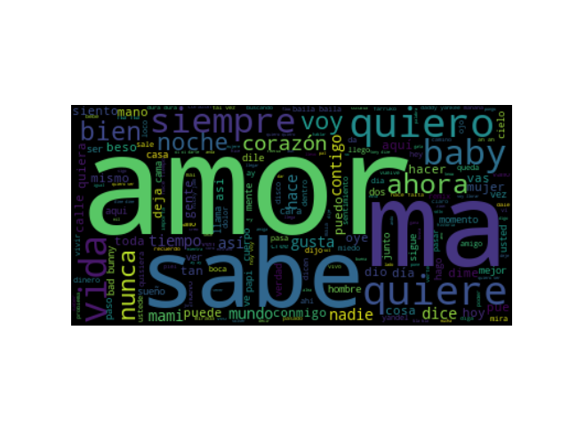
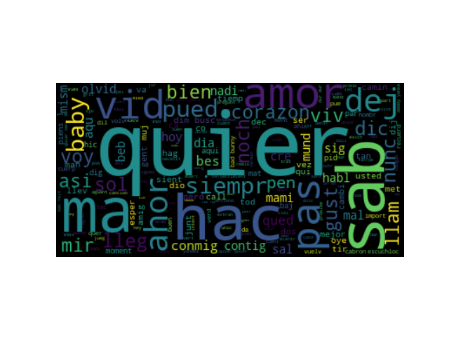

# Web Project

El objetivo aspiracional del proyecto es analizar todas las canciones de reggaeton para identificar en ellas contenido violento, machista, agresivo, sexual, malsonante, etc. Sin embargo, dada la dificultad de llegar hasta ese nivel de conclusiones, he decidido al menos hacer un análisis de sentimiento con la librería textblob.

## Pipeline description

A continación, se describen cada una de las funciones principales del pipeline, siguiendo la estructura ETL.

### scrape (E)

Se extraen los datos de www.letras.com mediante web scraping. El web scraping consta de 3 niveles:
* Página donde salen los nombres de todos los cantantes de reggaeton.
* Haciendo drill down: Página donde salen los títulos de todas las canciones de un artista.
* Haciedno drill down: Página donde sale la letra de una canción concreta de un artista.

Los datos se guardan en un dataframe con las columnas "Artist", "Title" (título de la canción) y "Lyrics".

### clean (T)

Esta función limpia los datos del dataframe generado, y los deja listos para el análisis. Las funciones de limpieza están descritas en el código.

Es importante destacar que cada canción (la letra), es una lista de strings, donde cada string es un verso. Es interesante tener la letra separada en versos, ya que el análisis de sentimiento debe hacerse por cada uno.

Al final de esta función, se exporta el dataframe en un json. El motivo es que como son tantas canciones de reggaeton (unas 2.500), no se puede hacer el scraping cada vez que se quiera llevar a cabo el análisis. Por ello, se vuelca todo a un json, que en la función siguiente del pipeline será el que importaremos y con el trabajaremos.

### extract (E, junto con scrape)

Se importa el json como un dataframe, para trabajar con él en la siguiente fase de manipulación de datos.

### transform (T)

Primero se añade una nueva columna al dataframe ('Translation'), en la que se hace la traducción de todas las canciones. El motivo de la traducción es que la mayoría de las canciones de reggaeton son en español, y la librería que se usará para el análisis de sentimiento funciona con inglés. Aunque lo deseable es que el análisis se hiciera en español, me ha gustado la idea de practicar con traducciones. Sin embargo, la librería con la que se han hecho las traducciones (textblob) tira de la API de Google Translate, por lo que tras haber hecho unas cuantas pruebas, ya no me obtiene datos por haber superado el límite de requests. Al parecer, no se renueva cada día, por lo que ya no puedo hacer uso de esta funcionalidad (al menos desde las IPs que uso habitualmente). Por tanto, esta columna se devuelve vacía (juro que antes se volcaba la traducción perfectamente, por lo que el código era correcto, palabrita del niño Jesús).

A continuación, se añade otra nueva columna al dataframe ('Sentiment'), en la que se hace el análisis de sentimiento de la columma de las canciones en inglés. Como comentaba, esa columna ahora se devuelve vacía, pero antes de que me lo caparan, se devolvían los valores de polaridad por verso correctamente. Aprecié que muchos versos tenían polaridad positiva cuando aparecían palabras como happiness, e incluso con frases como "I'm great for you".

Luego, se añade otra columna ('Sent_mean'), en la que se calcula la media de la polaridad (resultado del análisis de sentimiento) de todos los versos, por canción. El objetivo es identificar qué canciones tienen un valor total positivo o negativo.

Finalmente, se añade una nueva columna ('No_stopwords'), que contiene, para canción, todos los versos en español pero sin stopwords. El objetivo de esta columna es disponer de las palabras relevantes, de cara a dibujar una nube de palabras (en español).

### analyze (T + L)

Primero, hace un análisis de las palabras más relevantes y las imprime en una nube de palabras.
Segundo, hace stemming (de los versos en español) e imprime el resultado en una nube de lexemas. El stemming funciona mejor en inglés, pero he preferido hacerlo en español, para ver las palabras reales de las canciones.

### load (L)

Por último, exporta el dataframe en un archivo csv.

### main

La función main es la que lleva la batuta.
Por destacar algo de esta función, empieza varias líneas para comprobar si el json existe. Si existe, lo usa directamente, ignorando la función de scrape, y si no existe, hace el scraping.

## Files description

El proyecto está compuesto de los siguientes archivos. Cada uno de los archivos contiene funciones en su mayoría documentadas.
* main.ipynb: ejecuta el pipeline
* scraper.py: hace el web scraping de www.letras.com
* cleaner.py: limpia los resultados del scraping, para dejarlos listos de cara al análisis
* extractor.py: funciones para importar, ya sea de un json o de un csv
* transformer.py: transforma el dataframe, manipulando los datos y añadiendo columnas con la nueva información
* analyzer.py: realiza el análisis descrito en el apartado anterior
* loader.py: funciones para exportar, ya sea a un json o a un csv

Output files:
* Reggaeton_lyrics.csv: archivo csv que contiene todas las columnas comentadas, tanto las iniciales obtenidos durante el scraping como las que se van creando durante la ejecución del pipeline.
* Reggaeton_lyrics.json: archivo json que contiene solo la información de "Artist", "Title" y "Lyrics", obtenidas del scraping. Este archivo es el que se importa en la funcion extract del pipeline. Es necesario hacerlo con un json, porque si lo hiciéramos con un csv, la columna de Lyrics sería una lista de una string (la canción), en lugar de ser una lista de strings (versos).
* wordcloud.png: imagen de nube de palabras generada en la función analyze del pipeline.
* stemmed_wordcloud.png: imagen de nube de lexemas (stemming) generada en la función analyze del pipeline.

## Conclusiones

### Resultados

Dados los problemas con la función translate de textblob, no he podido sacar conclusiones finales contundentes. Antes de que me lo caparan, se devolvían los valores de polaridad por verso correctamente. Aprecié que muchos versos tenían polaridad positiva cuando aparecían palabras como happiness, e incluso con frases como "I'm great for you".

Por otro lado, las nubes de palabras son las siguientes (normal y con stemming):

### Problemas encontrados

Aunque lo he ido comentando a lo largo del readme, hago un resumen:
* El límite de peticiones de la función translate de la librería textblob, ya que tira de la API de Google Translate.
* Al inicio del proyecto, me llegó a hacer el scraping de todas las canciones (unas 2.500, guardé el archivo). Sin embargo, ahora siempre se me para el kernel, y desconozco el motivo.

## Cómo ejecutar el proyecto

### Librerías

En el proyecto se usan las siguientes librerías, que habrá que instalar antes de ejecutar el archivo principal:
* pandas
* requests
* bs4
* textblob
* nltk
* wordcloud
* matplotlib
* statistics
* os

### Archivos

Descargar todos los archivos en la misma carpeta y ejecutar el archivo main.ipynb.

## Next steps

Me gustaría utilizar la API de https://www.meaningcloud.com/ para obtener un análisis del contenido más riguroso. Es una herramienta dedicada especializada en text mining. Meaningcloud contiene un plan gratuito que permite hasta 20.000 peticiones al mes. Además, esto me permitiría incluir el uso de APIs dentro del proyecto.
